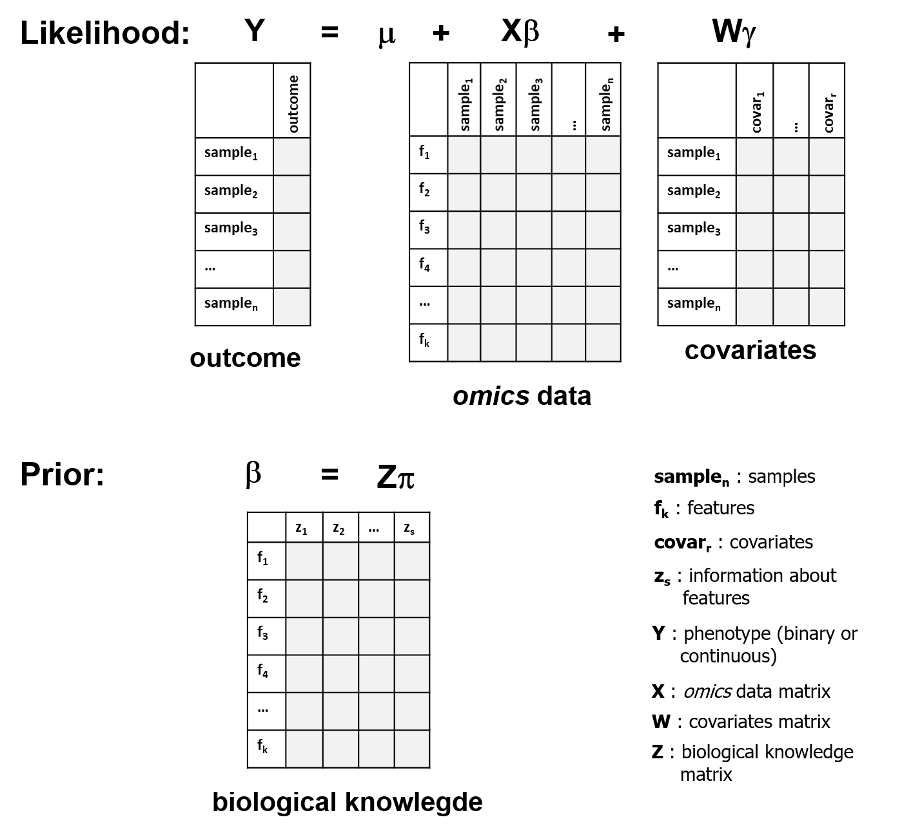
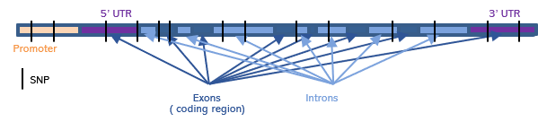
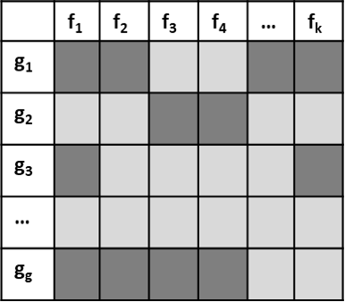

```{r style, echo = FALSE, results = 'asis'}

knitr::opts_chunk$set(cache = TRUE, 
                      warning = FALSE,
                      message = FALSE, comment = "")
```

# Introduction

**HOmics** package is designed to analyze *omic* data by incorporating biological knowledge aiming to improve effect estimates obtained from single association analyses. Instead of assuming that every *omic* feature is a priori equally likely associated with the outcome of interest, one can quantitatively incorporate existing information about the features into the analysis. The ultimate goal of this approach is to obtain a better rank of features by combining both, the effect estimates from the data and a priori biological knowledge.
The model is fitted in two levels hierarchical model, the first level is a regression model for the features, whose coefficients are adjusted in a second level using prior information.

**HOmics** uses a Bayesian approach that needs the JAGS (Just Another Gibbs Sampler) environment to be installed. This can be easily done through this link: [http://mcmc-jags.sourceforge.net/](http://mcmc-jags.sourceforge.net/).


Next We illustrate some examples that includes SNP association studies, where information about genic annotations can be incorporated in the analyses in a univariate or multivariate manner; epigenomic studies where relative position to the closest gene is incorporated for each CpG using bioconductor's standard classes and the last example, where we integrate gene expression with methylation data in the association to phenotype.

The general idea is described in the following figure

```{r fig1, fig.cap = "Hierarchical model", echo = FALSE}

```


```{r load}
library(HOmics)
library(dplyr)
```


# SNP association analyses

In the GWAS conext, each SNP is associated independently with the phenotype of interest. However, this conventional approach ignores existing information about the analyzed SNPs and assumes that they are all equally likely to impact the phenotype. Instead, one can incorporate information about the SNPs into a hierarchical model, in an attempt to improve the ranking of the p-values for association. There are several ways of incorporating a priori information. For instance, one can weight each SNP association p-value by how well it tags to SNPs that have been previously associated with our phenotype of interest as described in the GWAS catalog ([https://www.ebi.ac.uk/gwas/](https://www.ebi.ac.uk/gwas/)). The genetic distance to these SNPs can also be used. Another option is to incorporate existing information about the SNPs into a second-stage design matrix Z. This information could be: conservation, functional category, gene location, tagging or even linkage. Here we illustrate how genic location depicted in this figure can be used to improve single SNP assocation analyses:

```{r gene, fig.cap = "Genic annotation", fig.align="center", echo = FALSE}

```


Let us illustrate how to do the analyses by using a real data set on obesity. We have genotypes for a total of 73 SNPs measured in 300 idividuals. Data can be loaded directly from the package by:


```{r ob_load_data}
data("obesity", package="HOmics")
```

We have two different objects, one for the genotypes and another for the phenotypic variables. Notice that the rownames of both objects perfectly match

```{r ob_check}
snps[1:6, 1:5]
head(ob)
identical(rownames(ob), rownames(snps))
```

Now the idea is to associate each SNP with the obesity status (0: normal, 1: obese) by incorporating information abouth the gene position of each SNP as described in the previous figure. 

```{r ob_rids}
rsids <- colnames(snps)
head(rsids)
length(rsids)
```

One can locate SNPs in and around genes by using some Bioconductor's packages as follows:


```{r ob_snps}
library(GenomicRanges)
library(VariantAnnotation)
library(TxDb.Hsapiens.UCSC.hg19.knownGene)
library(SNPlocs.Hsapiens.dbSNP144.GRCh37)

txdb <- TxDb.Hsapiens.UCSC.hg19.knownGene
snps.annot <- SNPlocs.Hsapiens.dbSNP144.GRCh37

snpPos <- snpsById(snps.annot, rsids)
snps.loc <- GRanges(seqnames = seqnames(snpPos),
                    IRanges(start=start(snpPos),
                            end=end(snpPos)),
                    rs=snpPos$RefSNP_id)

seqlevelsStyle(snps.loc) <- seqlevelsStyle(txdb)
genome(snps.loc) <- genome(txdb)

loc <- locateVariants(snps.loc, txdb,  AllVariants())
loc <- merge(loc, snps.loc, all.x=TRUE)
m <- findOverlaps(snps.loc, loc)
mcols(loc)[subjectHits(m), "rs"] <-
  mcols(snps.loc)[queryHits(m), "rs"]
loc.unique <- unique(loc)
``` 

This is the information we have after being processed the previous chunk, a GRanges object

```{r ob_show_loc}
loc.unique[,c("LOCATION","rs")]
``` 

Then the Z matrix providing a priori biological knowledge can be created using this code. Notice that: 1) some SNPs may not be annotated; and 2) a given SNP may have 1 or more than one positions. This is addressed by aggregating Z matrix by the rownames. 
Notice that SNPs rs2908786 and rs3743772 are in two gene relative locations

```{r ob_make_Z}
location <- droplevels(loc.unique$LOCATION)
Z <- model.matrix(~ 0 + location)
colnames(Z) <- levels(location)
rownames(Z) <- loc.unique$rs

Z <- t(sapply(by(Z,rownames(Z),colSums),identity))
dim(Z)

head(Z)

head(sort(apply(Z,1,sum), decreasing = TRUE))
```

Next code illustrates how to fit the hierachical model. We start by selecting from the omic matrix those features with annotated information

```{r ob_Z}
rsids.ok <- rownames(Z)
omic.matrix <- as.matrix(t(snps[, rsids.ok]))
```


Then we create the W matrix which includes the covariates:

```{r ob_covar}
covar.matrix <- model.matrix( ~ gender + age, data=ob)
```

Finally the model is fitted by

```{r ob_HOmics}
mod <- HOmics(data.matrix = omic.matrix,
              cond = as.factor(ob$obese),
              z.matrix = Z,
              covar.matrix = covar.matrix)
```

The results are provided as an object of class *HOmics*

```{r ob_show_mod}
print(mod)
```
Results can be extracted using attribute results

```{r ob_mod_resuts}
mod$results
```

which is a tibble.

To visualize credible intervals

```{r ob_plot_mod, fig.height=4, fig.width=4, out.width="100%", fig.align="center"}
plot(mod)
```

We then can compare with the results obtained from single association analyses

```{r ob_SNPassoc}
library(SNPassoc)
dd <- cbind(snps, ob)
ii <- grep("^rs", colnames(dd))
dd.s <- setupSNP(dd, colSNPs = ii, 
                 name.genotypes = c(0,1,2))
ans <- WGassociation(obese, dd.s, model="log")
head(ans)
ans.odds <- odds(ans)

```

if we now plot SNPassoc log-odds confidence interval

```{r ob_SNPassoc_plot, echo = FALSE}
library(ggplot2)

ans.odds$feature <- factor(rownames(ans.odds), levels=sort(unique(rownames(ans.odds)),decreasing = TRUE)) 
ans.odds <- ans.odds[!is.na(ans.odds$OR),]

p <- ggplot(data=ans.odds) +
 geom_segment(aes(x=lower,y=feature,xend=upper,yend=feature),
              arrow=arrow(length=unit(0.15,"cm"),
                          ends='both')) +
  geom_vline(linetype   ='dashed',  xintercept = 1) +
  xlab ("OR 95% confidence interval") + 
  theme(panel.border = element_blank(),
        axis.text.y=element_text(size=6),
        axis.ticks.y = element_blank())
p

```

and finally compare results, by selecting those significative by each method and transforming SNPassoc results to log-odds.
Notice that objects are manipulated differently, as they are of different classes

```{r ob_compare_results}
res.homics <- mod$results[[1]]
res.homics.sig <- res.homics %>% filter(sign(`97.5%`) ==  sign(`2.5%`), n.eff>200) %>% mutate(int.l =`97.5%`- `2.5%`) 
res.homics.sig

res.snpassoc <- ans.odds
res.snpassoc.sig <- res.snpassoc[res.snpassoc$`p-value.log-additive`<0.05 & !is.na(res.snpassoc$`p-value.log-additive`),]

res.snpassoc.sig$log.odds <- log(res.snpassoc.sig$OR)
res.snpassoc.sig$log.lower <- log(res.snpassoc.sig$lower)
res.snpassoc.sig$log.upper <- log(res.snpassoc.sig$upper)

res.snpassoc.sig$int.l <- res.snpassoc.sig$log.upper - res.snpassoc.sig$log.lower

res.snpassoc.sig


```

Observe that significative SNPs associated to obesity are the same but the credible intervals (equivalent to confidence intervals) for **HOmics** approach are wider after including prior information. 

# Multivariate SNP association analysis

Instead of performing a univariate analysis for each feature, we can include all SNPs in a multivariate model to study the association with phenotype.
For that, the parameter agg.matrix must be specified with groups of features as depicted in the following figure

```{r ob_aggmatrix, fig.cap = "aggregation matrix", out.width = "50%", echo = FALSE}



```

In this case we will create a 1's matrix containing just one row representing a group and 73 columns, one for each SNP. We therefore consider all features included in this group g1

```{r ob_multiv_mod}

agg.matrix <- matrix(data=1,nrow=1,ncol=nrow(omic.matrix))

rownames(agg.matrix) <-"g1"
colnames(agg.matrix) <- rownames(omic.matrix)

mod.multiv <- HOmics(data.matrix = omic.matrix,
              cond = as.factor(ob$obese),
              z.matrix = Z,
              covar.matrix = covar.matrix,
              agg.matrix = agg.matrix)

print(mod.multiv)

```


If we want to assess more groups, it should be specified in the aggregation matrix, with groups in the rows and features in the columns.

The results are again provided as an HOmics object, and results show this time the coefficients for the multivariate model

```{r ob_show_multiv_mod}
mod.multiv$results
```

and we plot the coefficients of the multivariate model to visualize credible intervals

```{r ob_plot_multiv_mod, fig.height=4, fig.width=4, out.width="100%", fig.align="center"}
plot(mod.multiv)
```


# CpG methylation analyses using bioconductor's classes

In methylomics, CpGs are studied individually in their association to phenotype. However, there is some information that can be added to the model such as their relative position to the gene. We could here perform a similar analysis to the one displayed in previous section but **HOmics** contains a specific function, **HOmics.meth()** that takes advantage of standard Bioconductor classes. 
The function is prepared to process ExpressionSet (BioC) or GenomicRatioSet (minfi), standard classes when downloading GEO data using the GEOquery package. These objects have the following components:

- pheno data: information about the variables to analyze phenotype and covariate
- annotation data: featureData for an ExpressionSet  


The relative position of a CpG to the closest gene is in this case the prior information and it is directly extracted from the annotation data of the object.

We will in this example assess an ExpressionSet, extracted from the GEO series GSE117929. Data was previously downloaded using package `r Biocpkg("GEOquery")` and is accessible as data object  as the data object *GSE117929* in **HOmics**. `r Biocpkg("Biobase")` package is needed to manipulate ExpressionSet class objects.

GSE117929 contains a methylome-wide analysis of 37 samples of peripheral blood mononuclear cells of systemic sclerosis (N=18) and normal controls (N=19).

```{r meth_load_data_bioc}

library(Biobase)

data("GSE117929", package="HOmics")

GSE117929

table(pData(GSE117929)$"diagnosis:ch1")

```


The list of genes to model are obtained from [PMC5988798](https://www.nature.com/articles/s41598-018-26894-4), and we just call the function


```{r meth_model}

genes <- c("CCR5","CXCR4")

mod.meth <- HOmics.meth(meth.data = GSE117929,
                   pheno.cond.col = "diagnosis:ch1",
                   annot.gene.col = "UCSC_RefGene_Name",
                   annot.z.col = "UCSC_RefGene_Group",
                   annot.mult.sep = ";",
                   gene.list = genes,
                   cores = 1)

print(mod.meth)

```

Let us see the results

```{r meth_model_res}

mod.meth$results[[1]]

```

We filter the results of those CpGs in genes with high probability of positive coefficients (betas) and also of negative coefficients in the adjusted bayesian hierarchical model. In this example we filter at a significance level of 0.8 for demo purposes.

```{r meth_filter_res}

res.f.pos <- filter(mod.meth, param = "p.pos", threshold = 0.8, as.data.frame = T)
res.f.pos

res.f.neg <- filter(mod.meth, param = "p.neg", threshold = 0.8, as.data.frame = T)
res.f.neg

```

We finally plot 95% credibilty interval and use method signif to obtain significant results, ie those features with credibility intervals not containing 0.

```{r meth_plot_res, fig.height=4, fig.width=4, out.width="100%", fig.align="center"}

plot(mod.meth)
signif(mod.meth)

```

We will adjust the model with sex variable, which is specified in phenoData as 'gender:ch1'

```{r meth_sex_model}

genes <- c("CCR5","CXCR4")

mod.meth.sex <- HOmics.meth(meth.data = GSE117929,
                   pheno.cond.col = "diagnosis:ch1",
                   annot.gene.col = "UCSC_RefGene_Name",
                   annot.z.col = "UCSC_RefGene_Group",
                   annot.mult.sep = ";",
                   pheno.covar.col = "gender:ch1",
                   gene.list = genes,
                   cores = 1)

class(mod.meth.sex)

```

And we filter adjusted results

```{r _methfilter_res_sex}

res.meth.f.sex.pos <- filter(mod.meth.sex)
res.meth.f.sex.pos

res.meth.f.sex.neg <- filter(mod.meth.sex, param="p.neg")
res.meth.f.sex.neg

```

# Ovarian cancer gene expression and targeted by miRNAs

Gene expression can be modulated by the miRNAs, that bind to genes during transcription. We will see how these binding can modulate the association with phenotype.
For this example we will work with data from three different sources:

- ExpressionSet obtained from bicoconductor's package `r Biocpkg("curatedovarianData")` 
- Genes related to ovarian cancer obtained from [The human protein atlas, ovarian cancer](https://www.proteinatlas.org/humanproteome/pathology/ovarian+cancer) and availabel as a data object in **HOmics**
- Prior information of target miRNA downloaded from TargetScan website (v 7.2  [http://www.targetscan.org/vert_72/](http://www.targetscan.org/vert_72/)) and available as a data object in **HOmics**

We will assess the association with ovarian cancer of genes by fitting a hierarchical model where prior information known about genes are their predicted miRNAs.

```{r ov_eset}
# BiocManager::install("curatedOvarianData")

library(curatedOvarianData)
data(TCGA_eset)
TCGA_eset

```

Notice that TCGA_eset is an object of class *ExpressionSet*.
We will compare ovarian cancer tumor samples in stage 4 with recurrence versus healthy samples.
From the original TCGA_eset object, we will extract the expression data and the phenotype variables.

```{r ov_eset_sampleselection}

pheno <- pData(TCGA_eset)
table(pheno$sample_type)

TCGA_subset <- TCGA_eset[,pheno$sample_type=="healthy" | 
                           (pheno$sample_type=="tumor" & pheno$tumorstage==4 & pheno$recurrence_status=="recurrence")]

expr.m <- exprs(TCGA_subset)
dim(expr.m) 
pheno <- pData(TCGA_subset)

```

Let us obtain the condition vector. 

```{r ov_eset_condition}

cond <- pheno$sample_type
cond

```

The prior matrix with miRNAs that target our set of genes is obtained from the downloaded information obtained at TargetScan.

```{r ov_mirnas}

data("targets.hs.6.2", package="HOmics")

targets

```

Let's filter the targets to get only those with probability of conserved targeting (P<sub>CT</sub>) > 0.5 and generate the prior information matrix.

```{r ov_mirnas_filter}

targets.f <- targets %>% mutate(PCT= as.numeric(PCT)) %>% filter(PCT >0.5) 

z.table <- table(targets.f$`Gene Symbol`, targets.f$`miR Family`)

z.matrix <- as.matrix(as.data.frame.matrix(z.table))

z.matrix[z.matrix>1]<-1

table(z.matrix) # 0s and 1s only

```

Ovarian specific related genes are stored in a data object

```{r ov.genes}

data("ov.genes", package="HOmics")

ov.genes

```

To make sure that features (in this case genes) in the three data sets are the same, we do:

```{r ov_common_genes}

common.genes <- intersect(intersect(rownames(expr.m), ov.genes$Gene), 
                          rownames(z.matrix))
length(common.genes) 
expr.m <- expr.m[common.genes,]
z.matrix <- z.matrix[common.genes,]

mod.ov <- HOmics(data.matrix = expr.m,
              cond = cond,
              z.matrix = z.matrix)

mod.ov$results[[1]]
signif(mod.ov)

```

We compare these results with those obtained by standard approaches, limma is used to assess differential expression in the selected genes


```{r limma}

library(limma)
library(Biobase)

cond <-as.factor(cond)
design<-model.matrix(~0+cond)
colnames(design) <- gsub("cond","",colnames(design))

fit<-lmFit(expr.m,design)
contrast.matrix<-makeContrasts(tumor-healthy ,levels=design)
fit2<-contrasts.fit(fit,contrast.matrix)
fite<-eBayes(fit2)
tt<-topTable(fite,coef=1,number=Inf,adjust="BH",confint = TRUE) 
tt
res.limma <- tt[tt$P.Value<0.05,]

```
 
Which are less results than those obtained by HOmics
Plotting results:

```{r plot.ov.model}

plot(mod.ov)

```

```{r limma_plot, echo = FALSE}
library(ggplot2)

tt$feature <- factor(rownames(tt), levels=sort(unique(rownames(tt)),decreasing = TRUE)) 

p <- ggplot(data=tt) +
 geom_segment(aes(x= CI.L ,y=feature,xend= CI.L ,yend=feature),
              arrow=arrow(length=unit(0.15,"cm"),
                          ends='both')) +
  geom_vline(linetype   ='dashed',  xintercept = 0) +
  xlab ("OR 95% confidence interval") + 
  theme(panel.border = element_blank(),
        axis.text.y=element_text(size=6),
        axis.ticks.y = element_blank())
p

```

# Integration of *omics* data

In this example, we will use GEO public data from a data superseries (GSE117931) containing methylation data (GSE117929), used in previous example, but also expression data (GSE117928) from the same set of samples. 
GSE117928 expression data was downloaded as an ExpressionSet using package `r Biocpkg("GEOquery")` and is accessible as the data object *GSE117928* in **HOmics**.

We will integrate methylation of CpGs to the expression of the closest gene in the association of the phenotype variable, composed of 18 systemic sclerosis patients and 19 normal controls. Integration between gene expression and methylation is usually performed with correlations, as for instance, a hypermethylated site in the promoter of the gene can reduce its expression. The prior information will be in this case the correlation between the gene and the CpGs.

We will take the same genes as in previous example and will construct a model for each of them.

First we load the data

```{r load_data_exp}

library(Biobase)

data("GSE117928", package="HOmics")

GSE117928

table(pData(GSE117928)$"diagnosis:ch1")

```

we need to extract and prepare the objects

```{r integ_objects}

genes <- c("CCR5","CXCR4")

expression <- log2(exprs(GSE117928)+24)
beta.values <- exprs(GSE117929)

fdata.exp <- fData(GSE117928)
fdata.meth <- fData(GSE117929)

cond <- pData(GSE117928)$"diagnosis:ch1"
table(cond)

```


Now, the construction of the hierarchical model for each gene will be done with a simple loop, where the z.matrix is constructed as a vector of correlations of the gene and CpGs in the region

```{r integ model}

n <- length(genes)
n
res.gene <- list()

for(i in 1:n){
  
  gene <- genes[i]
  gene.annot <- fdata.exp[grep(gene, fdata.exp$Symbol),c("ID","Symbol" )]
  
  if (nrow(gene.annot) > 1) {
    gene.val <- apply(expression[gene.annot$ID,], 2, mean, na.rm = TRUE) 
  } else {
    gene.val <- expression[gene.annot$ID,]
  }
  
  cpgs.gene<- fdata.meth[grep(gene, fdata.meth$"UCSC_RefGene_Name"), c("ID","UCSC_RefGene_Name" )]
  cpgs.val <- beta.values[cpgs.gene$ID,]
  
  data.matrix <- as.matrix(t(gene.val))
  rownames(data.matrix) <- gene
  
  z.matrix <- cor(gene.val,t(cpgs.val))
  rownames(z.matrix) <-gene
    
  res.gene[[i]] <- HOmics(data.matrix = data.matrix, 
                          z.matrix = abs(z.matrix),
                          cond = cond)$results[[1]]
  names(res.gene)[i] <- gene
}

res.gene.t <- bind_rows(res.gene,.id="group")

res.gene.t

```


# Session info {.unnumbered}

```{r sessionInfo, echo=FALSE}
sessionInfo()
```

